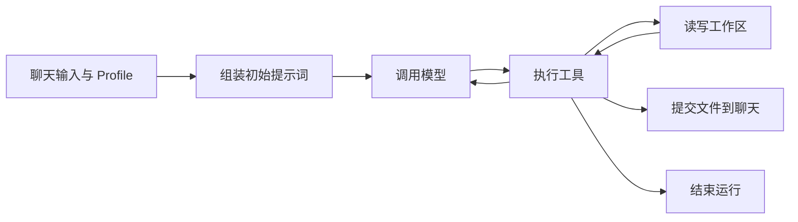

# Agent

TauriTavern 的 Agent 围绕文件工作：模型读取材料、修改工作区，再根据工具返回的结果继续处理，最后把选定的文件提交到聊天。运行过程写入追加日志，多个 Agent 则通过任务和结果交换信息。

这套结构把创作过程与聊天展示分开。草稿可以反复修改，辅助资料可以按需读取，聊天中呈现的是提交的内容。

## 从文件到工作区

一次生成称为一个 Run，每个 Run 有自己的工作区。`output/` 放输出，`scratch/` 放草稿，`summaries/` 放摘要；需要带到后续运行的内容放在 `persist/`。普通发送、重新生成和新 swipe 都会创建新的 Run。

聊天有稳定身份，因此重命名不会改变工作区归属。同一聊天的 Run 保存在一起，持久内容以独立版本连接前后两次运行。切换 swipe 时，可以沿所选消息对应的版本继续。

文件是 Agent 组织工作材料的方式。聊天历史、世界书和 Skill 保留各自的存储，通过工具提供所需内容；模型无需在开始时读入全部材料。目录和持久版本见 [Workspace](Workspace.md)。

## 在工作区中运行循环

Agent Loop 的每一轮都做同一件事：发送当前上下文，执行模型提出的工具调用，将结果加入上下文。

Profile 指定模型、提示词、可用工具和工作区范围。前端沿用 SillyTavern 的 PromptManager 组装初始提示词，Rust 接手后续循环。模型通过 `workspace.commit` 提交聊天内容，通过 `workspace.finish` 完成运行。后台运行可以只产生文件。

运行中的补充指令会在下一轮模型请求前加入上下文。取消操作结束当前 Run，已确认提交的聊天内容会保留。运行步骤与源码入口见 [运行循环](Runtime.md)。

## 用日志还原过程

每个 Run 的 `events.jsonl` 按顺序追加事件，记录模型回合、工具调用、文件修改、提交和终态。Timeline 根据这些记录展示过程；较大的工具结果和模型响应单独存成文件，事件保存引用。

工作文件可以修改，已经写入的事件保持原样。因此，即使关闭页面，也可以重新读取日志了解这次运行发生了什么。日志与保留的文件共同支持回看和诊断，读取方式见 [运行日志](RunEventJournal.md)。基于 checkpoint 的恢复与输出修订见 [运行循环](Runtime.md#checkpoint-与恢复)。

## 用任务连接多个 Agent

一个 Run 可以包含多个 Invocation。Invocation 是某个 Profile 的一次执行，拥有自己的模型上下文和工具循环，并与同一 Run 的其他 Invocation 共享工作区。

Agent 间的交互可以理解为管道：调用方送出任务包，接收方处理后送回结果包，文件路径用于传递较大的材料。源码用 `AgentTaskRecord` 记录这次传递，用 `continuation` 区分两种后续动作：

- 委派（`return_to_parent`）：子 Agent 在后台工作，调用方可以继续处理，之后通过 `agent.await` 收取结果。
- 交接（`transfer_control`）：当前 Agent 结束自己的循环，由下一个 Agent 接手前台工作和最终提交。

两种方式都复用相同的循环与工作区。具体用法见 [多 Agent 协作](SubAgent.md)。

## 开始使用

1. 在聊天补全连接中配置一个支持工具调用的模型，并保存当前预设。
2. 打开 Agent System，选择 `Default Writer`，开启 Agent Mode。
3. 正常发送消息，在运行历史中查看工具调用、工作区和提交结果。

默认 Profile 使用当前聊天的预设和模型。需要专门的写作、校对或资料整理 Agent 时，再复制 Profile，设置它的指令与工具。配置方法见 [Profile 与预设](ProfilesAndPreset.md)。

## 按任务查阅

| 要做的事 | 文档 |
| --- | --- |
| 理解文件、聊天提交与跨运行状态 | [Workspace](Workspace.md) |
| 修改启动、循环和收尾流程 | [运行循环](Runtime.md) |
| 读取历史、实现 Timeline | [运行日志](RunEventJournal.md) |
| 配置 Agent、独立模型与预设 | [Profile 与预设](ProfilesAndPreset.md) |
| 修改提示词组装 | [Prompt assembly](PromptAssembly.md) |
| 使用委派或交接 | [多 Agent 协作](SubAgent.md) |
| 添加工具或接入 MCP | [工具](ToolSystem.md) |
| 修改模型适配与续接 | [LLM gateway](LlmGateway.md) |
| 编写知识包或脚本 | [Skill](Skill.md) |
| 从扩展调用 Agent | [Agent API](../API/Agent.md) |
| 验证改动 | [测试](TestingStrategy.md) |

后端仍遵循仓库的 [crate 边界](../BackendStructure.md)。Agent 文档只维护当前行为；字段与默认值在对应类型或实现中查阅，专题文档解释用法和责任归属。
