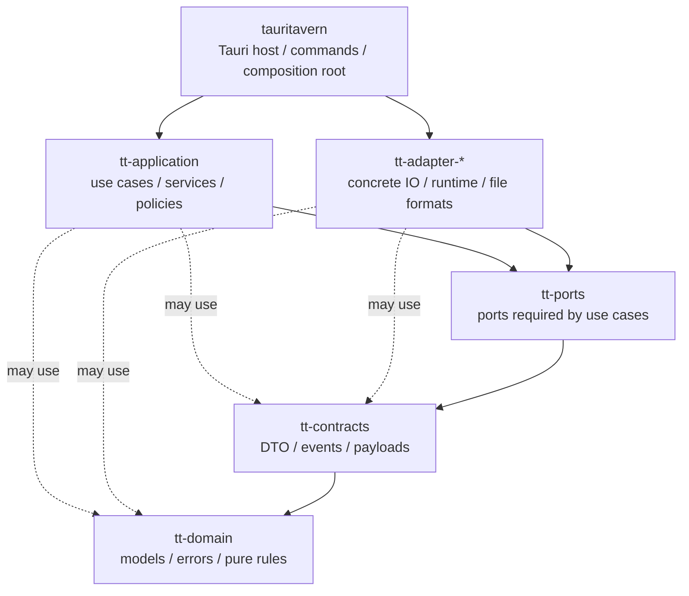

# TauriTavern 后端结构

本文档说明 TauriTavern Rust 后端的 **Clean Architecture 原则、workspace crate 边界、依赖方向和代码落点**。

它不是 API 命令清单，也不是专题实现百科。具体 API 参考 `docs/API/`，当前实现快照参考 `docs/CurrentState/`，前端宿主契约参考 `docs/FrontendHostContract.md`。

## 1. 最高约束：Clean Architecture

Clean Architecture 是 TauriTavern 后端最重要的长期约束。它不是一组漂亮的目录名，而是一条依赖规则：

> 越稳定、越靠近业务语义的代码越靠内；越依赖框架、文件系统、网络、平台 API 的代码越靠外；源码依赖只能从外层指向内层。

在本项目里，这条规则有几个直接含义：

- 领域模型和纯规则不能知道 Tauri、文件系统、HTTP、async runtime 或 repository。
- 用例可以表达“我需要某种外部能力”，但不能依赖具体实现。
- 具体 IO、文件格式、网络请求、ZIP、PNG、tokenizer、sync runtime 都是外层细节。
- host 可以知道所有实现，因为它负责启动和装配；但这种知识必须停留在 composition root 附近。
- 浏览器可观察的 SillyTavern 兼容语义是外部契约，不能被 Rust 内部分层命名替代。

因此，本项目的 Clean Architecture 不是靠约定俗成维护，而是被 Cargo workspace 和 `scripts/check-rust-crate-boundaries.mjs` 物理化、自动化地守住。

## 2. 从原则到 crate

当前 workspace crate 拆分，就是 Clean Architecture 的物理边界。理解这些 crate 时，不要先问“这个文件技术上用什么实现”，而要先问“这段代码属于哪一类变化原因”。

| Clean Architecture 概念 | 当前落点 | 稳定职责 | 不应承担 |
| --- | --- | --- | --- |
| Entities / 领域核心 | `tt-domain` | 领域模型、值对象、领域错误、纯规则、纯文本/JSON 工具 | repository trait、async runtime、文件系统、网络、Tauri |
| Cross-crate contracts | `tt-contracts` | 跨 crate DTO、事件、payload、observability、通用值契约 | concrete IO、application service、Tauri |
| Application ports | `tt-ports` | repository trait、gateway trait、event sink、runtime port、Host Resource opened-source port | concrete adapter、reqwest/axum/tauri/image/zip 实现 |
| Use cases | `tt-application` | service、use case、job coordinator、策略编排 | Tauri、adapter、reqwest、具体 tokenizer、文件格式实现 |
| Interface adapters | `tt-adapter-*` | Tauri-free 的具体 IO、运行时、持久化、文件格式、外部系统访问 | application service、Tauri host glue |
| Frameworks / Drivers | `tauritavern` | Tauri builder、plugins、setup、window、commands、composition root、platform glue | 领域规则、用例实现、Tauri-free repository |

这里有两个容易混淆但很关键的点：

- `tt-domain` 不定义 repository trait。repository 是用例对外部世界的需求，属于 port，不属于领域实体本身。
- `tt-adapter-*` 不是“比 application 更核心”的代码。它们可能很复杂，但复杂不等于内层。只要依赖文件系统、网络、第三方格式或运行时细节，就属于外层。

## 3. Workspace 总览

workspace 根目录是 `src-tauri/Cargo.toml`，默认 member 是 `crates/tauritavern`。

```text
src-tauri/
├── Cargo.toml
├── Cargo.lock
├── resources/
└── crates/
    ├── tauritavern
    ├── tt-domain
    ├── tt-contracts
    ├── tt-ports
    ├── tt-application
    ├── tt-adapter-http
    ├── tt-adapter-provider-http
    ├── tt-adapter-tokenization
    ├── tt-adapter-storage-core
    ├── tt-adapter-storage-userdata
    ├── tt-adapter-media
    ├── tt-adapter-extension
    ├── tt-adapter-sync
    └── tt-adapter-archive
```

当前 host 不再承载所有后端实现；用例、端口、契约、领域和具体 adapter 已经被拆成独立 Cargo crate。后续维护重点不是继续追求更多 crate，而是避免边界回流，确保每个新增能力都落在正确变化轴上。

| crate | 当前职责 |
| --- | --- |
| `tauritavern` | Tauri host、presentation command、composition root、host-bound infrastructure、platform glue |
| `tt-domain` | 领域模型、值对象、领域错误、纯规则 |
| `tt-contracts` | DTO、事件、payload、通用值契约、observability contract |
| `tt-ports` | repository / gateway / runtime trait、Host Resource opened-source port |
| `tt-application` | 用例服务、业务编排、任务协调、policy 执行 |
| `tt-adapter-http` | 共享 HTTP client pool/profile/helper |
| `tt-adapter-provider-http` | LLM、SD、Translate、TTS、provider metadata 的 HTTP repository |
| `tt-adapter-tokenization` | tokenizer concrete repository |
| `tt-adapter-storage-core` | `DataDirectory`、基础文件系统 helper、chat/settings/user/theme/secret/quick reply/prompt cache/asset/llm connection/extension-store |
| `tt-adapter-storage-userdata` | character、world info、agent workspace、agent profile、skill local package store、PNG card metadata |
| `tt-adapter-media` | avatar/background/user media/image metadata、browser-visible host resource file store |
| `tt-adapter-extension` | third-party extension 发现、安装、版本检查、更新、分支查询/切换、删除与移动；Gitoxide smart HTTP 与 embedded worktree |
| `tt-adapter-sync` | LAN Sync、TT-Sync v2 runtime、stores、client/server、sync jobs |
| `tt-adapter-archive` | data archive import/export executor、archive path safety |

## 4. 依赖方向

箭头表示 Rust crate 依赖方向。它们应当始终指向更内层、更稳定的策略或契约。



当前允许少量 adapter helper 关系：

```text
tt-adapter-provider-http    -> tt-adapter-http
tt-adapter-tokenization     -> tt-adapter-http
tt-adapter-extension        -> tt-adapter-http + tt-adapter-storage-core
tt-adapter-storage-userdata -> tt-adapter-storage-core
tt-adapter-media            -> tt-adapter-storage-core
```

禁止方向：

- `tt-domain` 不依赖 `tt-ports`、`tt-contracts`、adapter、Tauri、网络或文件系统。
- `tt-contracts` 不依赖 `tt-ports`、`tt-application`、adapter 或 Tauri。
- `tt-ports` 不依赖 adapter、Tauri、网络/文件系统具体实现。
- `tt-application` 不依赖任何 `tt-adapter-*`、`tauritavern`、`reqwest`、`axum`、`tauri`、`zip`、`image`。
- 任何 `tt-adapter-*` 不依赖 `tt-application` 或 `tauritavern`。
- host 的 `infrastructure` 与 `platform` 不下沉为 application 或 adapter 的隐式依赖；具体服务装配集中在 `app/composition`。

如果新增代码需要违反这些方向，通常不是边界脚本太严格，而是抽象落点还没有想清楚。

## 5. 上游兼容契约

TauriTavern 不复刻 SillyTavern 1.18.0 的 Node/Express 实现细节。它复刻的是上游前端、扩展、脚本和角色卡能观察到的契约：

- 同源 URL、HTTP method、状态码、请求体解析、JSON/text/stream 响应形状。
- 上传字段名和资源路径，例如 `/characters/*`、`/User Avatars/*`、`/backgrounds/*`、`/assets/*`、`/user/images/*`、`/user/files/*`、`/scripts/extensions/third-party/*`。
- 聊天 JSONL、角色卡 PNG metadata、世界书、预设、主题、用户目录等文件布局。
- 上游 `eventSource` 事件语义，例如生成、World Info、stream token、tool call 相关事件。

Rust command、Tauri Channel、repository/service 分层是内部实现，不能当成上游兼容 API 暴露给扩展作者。

兼容流量的真实链路是：

```text
SillyTavern frontend / extension / script
  -> same-origin fetch / jQuery.ajax
  -> src/tauri/main/interceptors.js
  -> src/tauri/main/routes/*
  -> context.safeInvoke(...)
  -> tauritavern presentation command
  -> tt-application service
  -> tt-ports trait
  -> tt-adapter-* concrete implementation
```

新的 TauriTavern 能力优先通过 `window.__TAURITAVERN__.api.*` 暴露。只有行为确实对齐上游 SillyTavern 路由时，才进入 `/api/*` 兼容层。

## 6. Host 边界

`tauritavern` 是最外层 host crate。它可以知道所有 concrete implementation，但只应在明确边界处使用它们。

主要目录：

```text
src-tauri/crates/tauritavern/src/
├── lib.rs                 # mobile entry / host lib entry，只转入 app::host::run()
├── main.rs                # desktop entry
├── app/
│   ├── host/              # Tauri builder、plugin、setup、window、resources、shutdown
│   ├── composition.rs     # composition root 入口
│   ├── composition/       # repositories、services、host adapters 装配
│   ├── state.rs           # AppState / AppServices / lifecycle handles
│   └── startup_profile.rs # 启动期 settings / policy snapshot
├── presentation/          # Tauri commands、CommandError、web resource adapter
├── infrastructure/        # Tauri-bound infrastructure
└── platform/              # iOS/UIKit、macOS/WebView、native UI glue
```

### 6.1 Host shell

`app/host/*` 是 Tauri shell：

- 安装 plugin。
- 决议 runtime paths。
- 初始化 logging、HTTP pool、bundled templates、host resource service。
- 创建窗口并挂载 web resource request hook。
- 启动异步 AppState 初始化。

这里可以触碰 `tauri::AppHandle`、window、plugin、platform API。这里不写业务用例。

### 6.2 Composition root

`app/composition/*` 是唯一可以同时知道 application service 与 concrete adapter 的地方。

维护规则：

- command 不直接构造 repository。
- service 不直接构造 concrete adapter。
- adapter 不调用 application service。
- `AppState` 只持有长期运行的 service 包、lifecycle handle 和启动期策略快照，不作为全局 service locator 下沉到 application 或 adapter。

### 6.3 Host-bound infrastructure

只有确实依赖 `AppHandle`、WebView、Tauri plugin、bundled resources、runtime path、平台 API 或 host lifecycle 的代码才留在 `tauritavern/src/infrastructure` 或 `platform`。

当前合理留在 host 的例子：

- runtime path 和数据目录选择引导配置。
- bundled resource 读取。
- logging / Dev observability 中需要 Tauri event 或 AppHandle 的部分。
- Data Archive 的 Tauri file picker/share glue。
- `file_content_repository` 与 `file_preset_repository`，因为它们仍依赖 packaged default content / bundled resources。
- 小型 host-bound API glue，例如更新检查和外部导入下载器。

新的 Tauri-free repository 不应再放回 host infrastructure。

## 7. Adapter 边界

adapter 是外层细节，但不是可以任意堆放的 common bucket。一个 adapter crate 应当对应一个清晰的 bounded context 或一组稳定变化原因。

当前实践：

- `tt-adapter-storage-core` 只承载基础 data root 能力和较底层的文件系统 helper。它不是“所有文件仓储”的新大桶。
- `tt-adapter-storage-userdata` 承载长期用户数据仓储，例如角色卡、世界书、Agent workspace/profile、Skill package。它关心 data root / user data 语义，而不是泛泛的“文件”。
- `tt-adapter-extension` 承载 third-party extension 发现、安装、版本检查、更新、分支查询/切换、删除与移动，以及 Git transport、repository 与 worktree 物化边界。扩展仓库不是普通 user data JSON。
- `tt-adapter-media` 承载浏览器可见的 avatar/background/user media 资源契约。
- `tt-adapter-provider-http` 和 `tt-adapter-tokenization` 可以复用 `tt-adapter-http`，但 provider 规则不能下沉到通用 HTTP helper。
- `tt-adapter-sync` 与 `tt-adapter-archive` 是独立运行时/执行器边界，Tauri UI glue 仍留在 host。

如果一个新 adapter 只是为了两个调用点提前抽象，先不要建 crate。等它有明确 bounded context、独立依赖成本或稳定变化原因时再拆。

## 8. Presentation 边界

`presentation` 是前端可调用的 Tauri command 与 WebView resource 边界。

规则：

- `#[tauri::command]` 只放在 `presentation/commands/*`。
- command 做参数解析、policy gate、错误映射和 service 调用，不写复杂业务流程。
- command registry 集中在 `presentation/commands/registry.rs`。
- 对上游兼容的 `/api/*` 行为主要由前端 route shim 维持，Rust command 名不是第三方稳定 API。
- 浏览器子资源必须通过真实可加载的 URL/Response 语义提供，不用 IPC/base64 假装资源加载。

## 9. 代码落点决策表

| 需求 | 放置位置 | 注意 |
| --- | --- | --- |
| 新领域模型、值对象、纯验证 | `tt-domain` | 不引入 async、IO、repository trait |
| 新跨 crate payload/event/DTO | `tt-contracts` | 只放契约，不放 service |
| 新 repository/gateway/runtime trait | `tt-ports` | trait 面向 application；具体实现不在这里 |
| 新用例、业务编排、job coordinator | `tt-application` | 依赖 port，不依赖 adapter |
| 新 Tauri command | `tauritavern/src/presentation/commands` | 调 service，不直接操作仓储细节 |
| 新 service/adapter 装配 | `tauritavern/src/app/composition` | 显式构造，避免 DI 容器或自动注册魔法 |
| 需要 AppHandle/WebView/plugin/platform API | `tauritavern/src/app`、`infrastructure` 或 `platform` | 不下沉到 adapter |
| data root/default-user 的基础文件仓储 | `tt-adapter-storage-core` | chat/settings/user/theme/secret 等基础存储 |
| 角色卡、世界书、Agent workspace/profile、Skill package | `tt-adapter-storage-userdata` | skill 是 local package store，不是普通 JSON repo |
| 第三方扩展安装、更新、发现 | `tt-adapter-extension` | 不归入 storage-userdata |
| avatar/background/user media/host resource 文件读取 | `tt-adapter-media` | 保持浏览器资源契约 |
| LLM/SD/Translate/TTS/provider metadata HTTP | `tt-adapter-provider-http` | 复用 `tt-adapter-http` |
| 通用 HTTP pool/profile/helper | `tt-adapter-http` | 不放 provider 业务规则 |
| LAN/TT Sync runtime | `tt-adapter-sync` | Tauri event/UI adapter 留 host composition |
| Data Archive import/export executor | `tt-adapter-archive` | Tauri picker/share 留 host infrastructure |

## 10. 添加后端能力的最小流程

新增能力时，先从契约和变化原因出发，再决定文件位置：

1. 判断这是上游兼容行为，还是 TauriTavern 新能力。
2. 上游兼容行为保持 `/api/*`、资源路径、stream 和事件语义。
3. 新能力优先走 `window.__TAURITAVERN__.api.*`。
4. 如有新业务概念，先放 `tt-domain`。
5. 如有外部 IO 或持久化边界，在 `tt-ports` 定义最小 trait。
6. 在 `tt-application` 写 service/use case。
7. 在合适的 `tt-adapter-*` 写 concrete implementation。
8. 在 `tauritavern/src/app/composition` 装配。
9. 在 `tauritavern/src/presentation` 增加 command。
10. 在前端 route 或 Host ABI 层接入。
11. 更新相关文档和 guard/test。

如果一个新抽象只有一个实现，先不要加。Rust 项目里显式构造通常比通用 DI、factory、inventory/linkme 更容易维护。

## 11. 数据目录与文件布局

数据目录布局是 SillyTavern 兼容契约的一部分。目录名大小写和空格不能随意改，例如：

- `default-user`
- `characters`
- `chats`
- `group chats`
- `User Avatars`
- `QuickReplies`
- `OpenAI Settings`
- `TextGen Settings`

TauriTavern 私有状态放在 `_tauritavern` 下，例如 agent workspace、agent profiles、skills、prompt cache、legacy extension source metadata、LLM connections。

权威代码入口：

- `src-tauri/crates/tt-adapter-storage-core/src/file_system.rs`
- `src-tauri/crates/tt-domain/src/models/user_directory.rs`
- 桌面数据目录选择现状见 `docs/CurrentState/DataDirectorySelection.md`

## 12. 专题文档导航

`BackendStructure.md` 只保留总边界。细节进入专题文档：

| 主题 | 文档 |
| --- | --- |
| 前端 Host ABI、请求拦截、资源契约 | `docs/FrontendHostContract.md` |
| 前端集成结构 | `docs/FrontendGuide.md` |
| 扩展作者 API | `docs/API/README.md` |
| Chat payload（完整历史、原子提交、只读分页） | `docs/CurrentState/ChatPayload.md` |
| Third-party extension 资源和发现 | `docs/CurrentState/ThirdPartyExtensions.md` |
| 媒体 Range / browser resource contract | `docs/CurrentState/MediaAssetContract.md` |
| Logging / Dev observability | `docs/CurrentState/LoggingObservability.md` |
| Native provider API formats | `docs/CurrentState/NativeApiFormats.md` |
| Sync | `docs/CurrentState/Sync.md` |
| Agent 总览 | `docs/AgentArchitecture.md` |
| Agent 细节 | `docs/Agent/README.md` |
| iOS policy | `docs/CurrentState/iOSPolicy.md` |

## 13. 验证

架构边界变更至少运行：

```bash
pnpm run check:rust-boundaries
```

按影响面追加：

```bash
pnpm run test:rust:split-crates
pnpm run test:rust:host-resources
pnpm run check:rust:dev
cargo test --manifest-path src-tauri/Cargo.toml -p <affected-crate> <focused-test>
```

涉及前端 route shim、Host ABI 或资源端点时，还要运行前端 contract/guard：

```bash
pnpm run check:frontend
pnpm run check:types
pnpm run check:contracts
```

## 14. 常见误区

- 不要把 Clean Architecture 理解成“多建几层目录”。真正的边界是依赖方向和变化原因。
- 不要把 repository trait 放回 `tt-domain`。
- 不要让 `tt-application` 依赖 concrete adapter。
- 不要让 adapter 依赖 `tauritavern`、`AppState` 或 presentation command。
- 不要把 Tauri-free 文件仓储塞回 host infrastructure。
- 不要把 `tt-adapter-storage-core` 变成新的 common 大桶。
- 不要为了两个 ZIP 调用提前抽一个泛化 `common-archive` crate；等第三个真实 bounded context 出现再说。
- 不要把 Tauri command 名当作扩展公共 API。
- 不要用 IPC/base64 替代浏览器原生子资源语义。
- 不要静默降级上游契约。字段无法保真、provider metadata 无法表达、目录状态不可恢复时，应显式失败。
